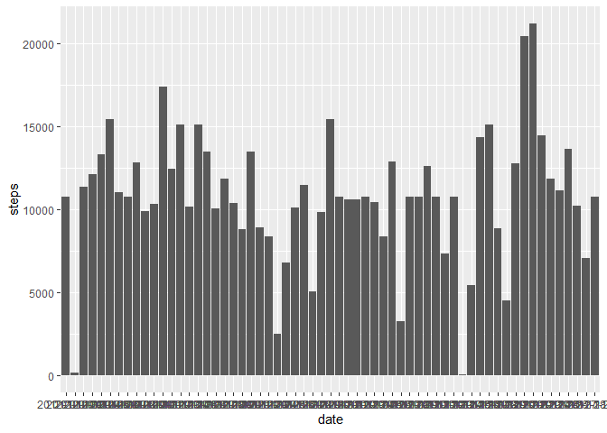
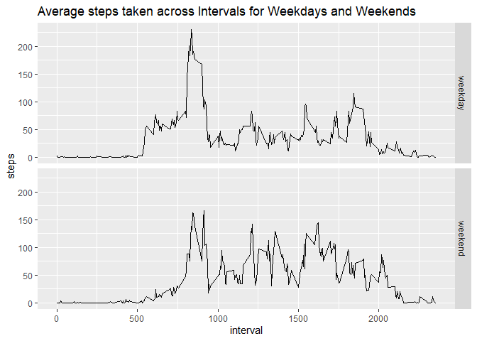

## Loading and preprocessing the data

```r
activity <- read.csv("activity.csv")
```


## What is mean total number of steps taken per day?

```r
# total steps per day
sum_steps <- aggregate(steps ~ date, activity, sum)
colnames(sum_steps)[2] <- "sumSteps"

library(ggplot2)
ggplot(sum_steps, aes(date, sumSteps)) +
    geom_bar(stat="identity")
```

<!-- -->

```r
# mean total steps per day
mean(sum_steps$sumSteps)
```

```
## [1] 10766.19
```

```r
# m <- summarize(group_by(activity, date), meanSteps=mean(steps, na.rm=TRUE))

# median total steps per day
median(sum_steps$sumSteps)
```

```
## [1] 10765
```


## What is the average daily activity pattern?

```r
avg_interval <- aggregate(steps ~ interval, activity, mean, na.rm=TRUE)
ggplot(avg_interval, aes(interval, steps)) +
    geom_line(lwd=0.7)
```

<!-- -->

```r
# plot(avg_interval$interval, avg_interval$steps, type="l")

# the interval with maximum number of steps
avg_interval[which.max(avg_interval$steps), "interval"]
```

```
## [1] 835
```


## Imputing missing values

```r
# total number of missing values in the data set
sum(colSums(is.na(activity)))
```

```
## [1] 2304
```

```r
meanSteps_byInterval <- aggregate(steps ~ interval, activity, mean, na.rm=TRUE)
activity2 <- activity
colnames(meanSteps_byInterval)[2] <- "meanSteps"

# adding a column of mean steps for each interval to the main data frame
activity_noNA <- merge(activity2, meanSteps_byInterval, by="interval")
library(plyr)
activity_noNA <- arrange(activity_noNA, date, interval)

# replacing the missing values of steps with mean value for that interval
activity_noNA[is.na(activity_noNA$steps), "steps"] <- round(activity_noNA[is.na(activity_noNA$steps), ]$meanSteps)

#-----

# histogram for steps taken across days
library(ggplot2)
ggplot(aggregate(steps ~ date, activity_noNA, sum), aes(date, steps)) +
    geom_bar(stat="identity")
```

<!-- -->

```r
# mean total steps per day
mean(aggregate(steps ~ date, activity_noNA, sum)$steps)
```

```
## [1] 10765.64
```

```r
# m <- summarize(group_by(activity, date), meanSteps=mean(steps, na.rm=TRUE))

# median total steps per day
median(aggregate(steps ~ date, activity_noNA, sum)$steps)
```

```
## [1] 10762
```


## Are there differences in activity patterns between weekdays and weekends?

```r
activity_noNA$day <- weekdays(as.Date(activity_noNA$date))

activity_noNA$daytype <- as.factor(ifelse(activity_noNA$day %in% c("Saturday","Sunday"), 
                                "weekend", "weekday"))

ggplot(aggregate(steps ~ interval+daytype, activity_noNA, mean, na.rm=TRUE), aes(interval, steps)) + 
    geom_line(lwd=0.7) + facet_grid(daytype~.) +
    labs(title="Average steps taken across Intervals for Weekdays and Weekends")
```

<!-- -->
